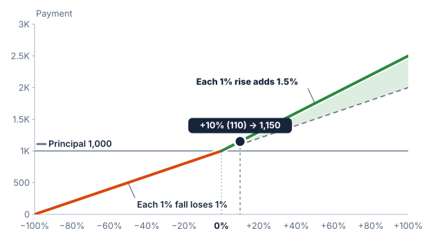

# Participation

Participation states how much of the measured underlier return contributes to
the product's return. Upside and downside rates are separate terms.

## Upside participation

With principal of 1,000 and an underlier rise of 10%, 150% upside
participation produces a 15% contribution:

```text
150% × 10% = 15%
Payment = 1,000 × (1 + 15%) = 1,150
```

At 50% participation, the same rise produces a payment of 1,050. The rate
changes the slope of the payoff. It does not set a maximum gain; a cap does
that.



## Downside participation

At a 100% downside rate, a 20% fall reduces principal by 20%, giving 800
before any floor. At a 150% downside rate, it reduces principal by 30%, giving
700. A buffer or barrier can change which fall that rate applies to.

## Separate choices

In the synthetic model, upside only means a fall leaves principal unchanged.
Downside only means a rise leaves principal unchanged. Selecting both uses each
rate in its own direction. A flat return pays principal unless another feature,
such as the minimum return a deposit can have (see the [Market-linked deposits
chapter](14-market-linked-deposits.md)), raises the payment.

## Assumptions

These examples have no cap, buffer, barrier, or protection floor. SPIRe floors
an unprotected note's payment at zero, even when a high downside rate would
otherwise calculate a negative amount. This is a rule of the learning model;
the holder does not owe an additional payment in these examples.
