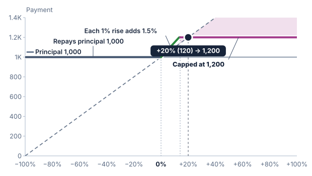

# Cap

A cap limits the return contributed by upside participation. It is expressed
as a percentage of principal in these examples, not as an underlier level.

## Reaching the cap

A synthetic note has principal of 1,000, 150% upside participation, and a
20% upside cap.

```text
At a 10% rise: 150% × 10% = 15%; payment = 1,150
At a 20% rise: 150% × 20% = 30%, capped at 20%; payment = 1,200
At a 50% rise: contribution is still capped at 20%; payment = 1,200
```



The cap starts binding at an underlier rise of approximately 13.33%:

```text
20% ÷ 150% ≈ 13.33%
```

A lower participation rate alone does not cap the payment. Without a cap,
even a small rate continues to add a contribution as the underlier rises.

## Scope of this cap

SPIRe places the cap on upside participation. It does not cap an
absolute-return contribution paid on a fall. When that feature exists, the
upside cap is not necessarily a maximum on every possible payment.

An upside barrier (see the [Barrier chapter](12-barrier.md)) also limits what a rise can pay, but in a
different way: it ends participation at a level and may pay a fixed rebate in
its place, so the payment can fall at the barrier. SPIRe does not combine a
cap and an upside barrier on the same upside participation.

The synthetic example's 20% cap has no effect on a fall and does not replace
the payment floor. Contractual caps in other products must be read with their
own scope and formula.
