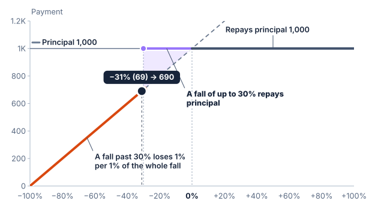
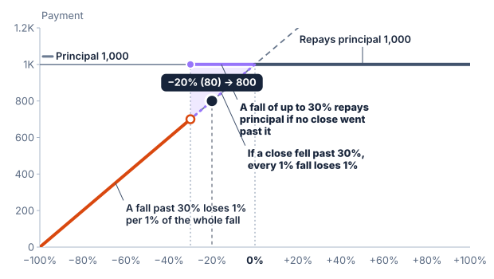
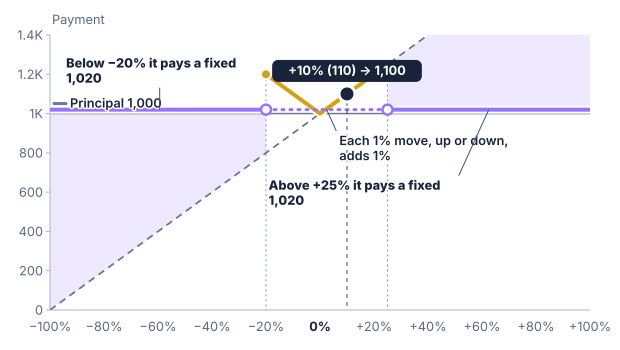

# Payoff diagrams and scenarios

A payoff diagram plots a contractual payment for each hypothetical measured
underlier return. A scenario table shows selected points on the same rule.
Neither assigns a probability to those outcomes.

## Reading the axes

SPIRe's horizontal axis shows percentage change from the determined starting
level. Its vertical axis shows payment amounts. Zero change lies at the initial
level; repayment of principal is the baseline payment.

A 100% upside participation line rises by 10% of principal for each 10%
underlier rise. A cap flattens that line once the permitted contribution is
reached. A protection floor stops the payment falling below its stated amount.
The dashed 1:1 reference shows payment moving proportionally with the underlier.

## Jumps and endpoints

A final-observation barrier can produce a jump. At a 70% barrier, principal
may be repaid at −30% return while the whole fall counts just below it.
A filled point indicates the payment at the threshold; an open point marks
an excluded endpoint of the neighbouring branch.

An upside barrier jumps the other way. A line that rises with the underlier
drops at the barrier to the rebate level, or to principal when there is no
rebate. The filled point is the payment at the barrier, the top of the drop,
and the open point is the rebate level just above it, which the barrier level
itself does not pay.

There is no line connecting the branches. Such a line would imply intermediate
payments that the rule does not produce.

## Two paths for a barrier observed on every close

When a barrier is observed on every close, the payment depends on more than the
final level. The solid line is the payment when no close reached the barrier.
A dashed line, in the barrier's colour, is the payment had a close reached it
earlier. For a downside barrier it runs between the barrier and the initial
level, where a recovered underlier still pays the whole fall. For an upside
barrier it runs below the barrier, where an earlier close has already earned the
rebate. The final-level marker sits on whichever line the scenario's lowest or
highest close puts it on, so it can sit on the dashed line.

## A V between two barriers

Absolute return in both directions draws a V. Between the barriers the payment
falls as the underlier rises from the lower barrier to the initial level, where
it is principal, and rises again as the underlier rises beyond it, since a fall
and a rise of the same size pay the same.
Beyond each barrier the line is flat at the fixed return, with a jump at the
barrier. The filled point of each jump is the payment at the barrier level, which
is the absolute return, and the open point is the fixed return just beyond it. If
a barrier is observed on every close, a dashed flat line at the fixed return
shows the payment had a close gone beyond a barrier earlier. The scenario table
adds a row at each barrier, a row just past each, and a row for each barrier
observed on every close where the underlier returned to the initial level after a
close beyond it, labelled with that close.

## Choosing scenarios

Include a rise, no change, a modest fall, and a large fall. At a threshold,
also check equality and levels immediately on either side. For a basket,
one basket return can result from many different component performances.

With averaging or lookback, the chart uses the determined levels for the
assumed observations. A final-return diagram alone cannot show every possible
observation path. For a barrier observed on every close, the dashed line and the
scenario's lowest or highest close stand in for the path, and the scenario table
adds a row where the barrier was reached and the underlier then moved back
towards the initial level, labelled with the close that reached it.
