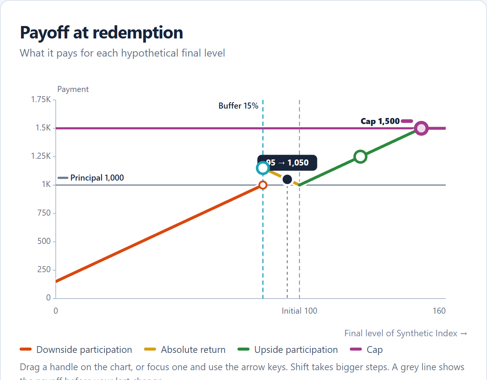
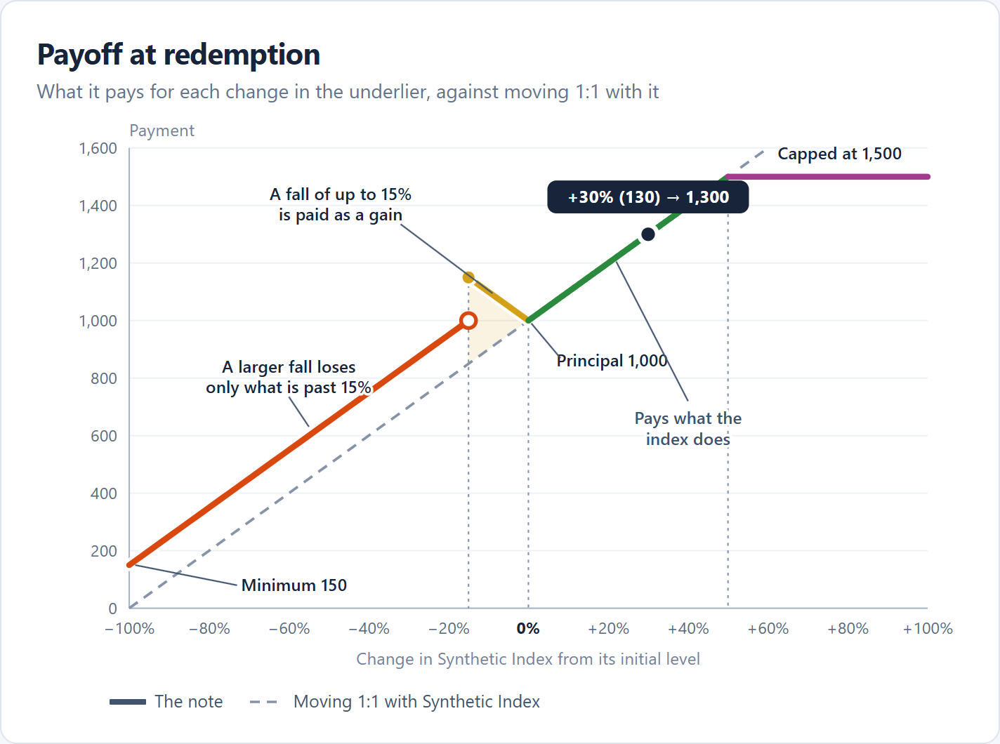

# Payoff chart

This is a proposal to redesign the payoff chart so a reader can understand a payoff from the chart alone. It changes how the chart draws a payoff, not what any product pays. It does not add starting examples, which are a separate idea (see the open questions). Nothing here is built yet.

## The problem

With several features, the chart is accurate but hard to read. Two causes add up:

- **Free combination.** The outline lets a reader combine features no public note combines, such as a 90% protection floor with a 10% buffer, absolute return and a 20% cap. Five rules then take turns between final levels 80 and 120, a quarter of the width.
- **The chart shows what, not why.** It compares the payment only with principal, so nothing says whether the note did better or worse than the underlier. Meaning sits in colour and a legend, so a reader matches colours to the legend and the legend to the outline. The horizontal axis is in index levels, 0 to 160, with the initial level off centre at 100, so every reading needs a conversion to a percentage. Guide lines and handles add to the clutter even when the reader is not dragging anything.

## What a public filing does

The capped dual directional note's payoff diagram ([No. 19,026](https://www.morganstanley.com/structuredinvestments/docs/prospectus/prelim/ProspectusRed61781LXR6.pdf), page 4) is easier to read with fewer means:

- **A reference line for the underlier.** A dashed diagonal, "The Underlier", is what a payment moving 1:1 with the index would be. The note's line is read against it: above it the note does better, below it worse. A grey triangle fills the gap where absolute return pays more than the index.
- **% change on the horizontal axis**, from −100% to +100%, centred on 0%.
- **Labels on the features**, with arrows: "Maximum Upside Payment at Maturity", "Minimum Payment at Maturity", "Stated Principal Amount". There is no colour key.
- **Little else.** One black line, thin dotted droplines at the points where the rule changes (−15%, 0%, +69%), and a filled and an open dot at the jump.

## Before and after

The same synthetic note in both: 100% downside participation, a 15% buffer, 100% absolute return, 100% upside participation and a 50% cap, with no protection. The mock's hypothetical final level is +30% (130); the current chart's is 95. The mock is a static drawing ([payoff-chart-mock.html](images/payoff-chart-mock.html)), not the app.

| Current | Proposed |
| :---: | :---: |
|  |  |

## Proposal

1. **An underlier reference line.** A neutral grey dashed diagonal, principal × (1 + return), labelled "Moving 1:1 with Synthetic Index" (or "with the basket"). It is drawn behind the note's line, so where the note pays exactly what the index does (100% upside participation), the two coincide and the reader sees that. It is not "owning the index": it ignores dividends and costs, and the label says what it is rather than what it would earn.
2. **Shade the gap a selected feature makes.** When a feature is selected, the area between the note's line and the reference line over the levels where that feature sets the payment is tinted in its colour, as the filing's grey triangle shows absolute return. Nothing is shaded at rest, so the resting chart stays calm. The mock shows absolute return selected.
3. **% change on the horizontal axis.** The axis is the return the payoff reads, fixed from −100% to +100%, with 0% in bold at the centre. It is measured from the level the return is measured from: the initial level, the lookback level, or the basket's starting level. The axis title names the underlier: "Change in Synthetic Index from its initial level". The final-level bubble shows both, "+30% (130) → 1,300", so the level is still there for a reader who thinks in levels.
4. **Labels on the features.** Each feature that changes the line gets a short label, in Ink, with a thin leader to the piece it describes: "A fall of up to 15% is paid as a gain", "A larger fall loses only what is past 15%", "Capped at 1,500", "Minimum 150", "Principal 1,000", "Pays what the index does". The wording comes from the content layer, from the same breakdown as the calculation, so the labels cannot disagree with the payment. The colour key shrinks to two entries: the note and the reference line.
5. **Keep the colours, quieter.** Each piece of the line keeps its concept colour, as the One Concept, One Colour rule requires, and the outline and summary still match it. The labels carry the meaning, so colour is no longer the only way to tell the pieces apart.
6. **Droplines instead of guides.** The full-height dashed guides for the buffer, barrier and initial level become thin dotted droplines from the line to the axis at the points where the rule changes. The cap and floor guide lines across the plot go: the line itself and its label show them.
7. **Handles when they are wanted.** At rest the chart shows the line, the labels and the final-level dot. Feature handles appear when the pointer is over the chart, when a feature is selected, or when a handle has keyboard focus, so they stay discoverable and keyboard access is unchanged.

The vertical axis is unchanged: zero stays at the bottom, so the chart never exaggerates a gain or a loss, and it is fitted to the highest amount shown (section 14 of [PLAN.md](../PLAN.md)).

## What stays

- The payment, every content function, the outline, the summary, the JSON, the calculation and the scenario table.
- One colour per concept, and selection highlighting across every view.
- The jump marks: filled where a level pays, open just below.
- Dragging, arrow keys and the ghost line of the payoff before the last change.

## What changes in DESIGN.md and PLAN.md

- **DESIGN.md, Payoff chart (signature).** Replace the description of guide lines and always-visible handles with the reference line, labels with leaders, droplines, shading on selection, and handles on demand. Add the reference line's style (1.75px dashed). State that labels, not colour, carry meaning on the chart.
- **PLAN.md, section 9** said colour, direct labels and a legend carry identity. The legend becomes a two-entry key and the labels become the main carrier. **Section 14** keeps its vertical-axis rules; its horizontal axis (scaled on the initial-level term) is replaced by the % axis.

## Decisions

1. **Horizontal range.** *Decided: fixed at −100% to +100%*, as the filing draws it. A fixed range is predictable and always shows a fall to zero. A cap reached only beyond +100% (a low upside rate) is then off the chart; its label sits at the right edge with "reached at +250%".
2. **The reference line's colour.** *Decided: a neutral grey dashed line*, as the filing's is black. The underlier's Iris (#7a5cb5) was considered and set aside: it is close to the barrier's Lavender (#9775fa), and both would be dashed on the same chart. A neutral line is a reference, not a concept, so it does not break the One Concept, One Colour rule. Faint (#8794a8), drawn in the mock, is 2.99:1 against white, just under the 3:1 a chart line needs, so the build uses a darker grey such as Muted (#66758b, about 4.7:1). Its dashes keep it apart from the solid principal line.
3. **Lookback.** On a % axis measured from the lookback level, the pricing-date level becomes a point at its own positive change, such as +8.7% when the lookback level is 92. Does it keep its own reference line, or move into the bubble and the calculation?
4. **Label placement.** Labels must avoid each other, the final-level bubble and the line, for any combination of features. The mock places them by hand, and even there the principal label first collided with the bubble. The build needs a placement rule: a fixed slot per feature (above or below its piece), a priority order, and dropping lower-priority labels when space runs out, with the selected feature's label always shown.
5. **Deposits and protection.** A deposit with a minimum return, or a protected note, has a floor well above the reference line on large falls. Is shading on selection enough to show what protection buys, or should the floor always shade its gap?

## Open questions

- **Starting examples.** Free combination is half the problem. A small menu of synthetic starting notes shaped like public structures (buffered, barrier, capped participation, dual directional) would give readers payoffs that make sense to start from. It is a separate proposal.
- **The ghost line** on a % axis. If the reader changes the lookback count, the ghost's axis would differ from the current one. It may be simplest to hide the ghost when the measured-from level changes.

## Build order, once agreed

1. Geometry: the % axis and the reference line, with tests (`src/chart/geometry.ts`).
2. Content: feature labels from the payment breakdown, with tests, in a new pure module beside the calculation.
3. Interface: droplines, labels and placement, shading on selection, handles on demand.
4. DESIGN.md and PLAN.md updates, and a check in the browser with the public examples and with a crowded payoff.
